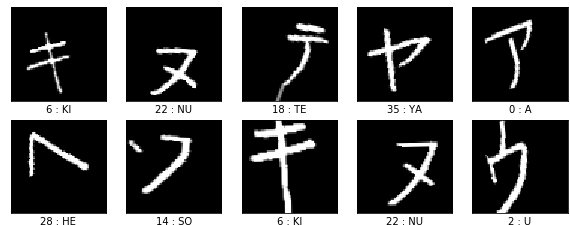

# Frurigana Handwriting Recognition
A convolutional neural network (CNN) based model is built to classify japanese characters, i.e. Furigana. Furigana consists of Hiragana (Hi.) for normal use , and Katakana (Ka.) for foreign words or enphasis purpose. The model is trained to run Android on-device hand-written input classification powered by TensorFlow lite.



### The work includes:
- extremely simple image noise clean and signal enhancement
- augmentation generates variation of original sample to increase field accurary
- 4 layered CNN model can reach validation accuracy ~98%

### Data Source:
All training sample are from [ETL Character Database](http://etlcdb.db.aist.go.jp/). The site collects multiple database from ETL1 to ETL9 with various contents, source, and format. This work uses ETL6 (Katakana) and ETL7 (Hiragana) databases. All data should retrieve from the site and cannot be commercial use without officient agreement.

## Setup Guide

### Clone The Repo
clone the repo to your local directory
```
$git clone https://github.com/saluf/ml-furigana-handwriting-recognition.git
```

### Get Training Data And Script From ETL
Before start it is needed to get [training samples](http://etlcdb.db.aist.go.jp/obtaining-etl-character-database) and [sample script](http://etlcdb.db.aist.go.jp/file-formats-and-sample-unpacking-code) at [ETL Character Database](http://etlcdb.db.aist.go.jp/). Once all done, unzip **training samples** and **sample script** into default setting directories as below.

```
TensorFlowFurigana.ipynb
encoder_table.py
├─input : Traning sample here. We need ETL6C_01~ETL6C_05 and ETL7LC_1~ETL7LC_2
├─model : Output .tflite model
└─unpack : Sample script here. It should consists of two scripts unpack.py and euc_co59.dat
```

### Install Dependencies
Except for the depdencies of the **sample script**, this work uses following third-party libraries

```
tensorflow==2.3.0
numpy==1.18.1
scikit-learn==0.22.1
matplotlib==3.1.3
```

### Run
Now you should ready to run! :clap:

## License
The work is under MIT License. You can check more detail in the license file.
